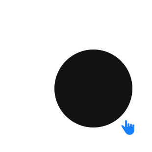

# Fitts' Law Project

## Overview

For this project, you will write a simple program to test *[Fitts' Law](https://lawsofux.com/fittss-law/)*. In this experiment, you will measure how fast a user can point to and click on targets shown on the screen while using a mouse, trackpad, or touchscreen. You will then use the data you collect to prove Fitts' Law.

## Experimental Design

The experimental design is as follows:

* You will **recruit ten (10) participants** to participate in the experiment.

* Each participant will engage in a **test**. The test will consist of 180 **trials**.

* At the beginning of a test, present participants with a welcome screen which includes an **informed consent** electronic statement. Have participants agree (and record their choice) before beginning the experiment. This can be done with a button on the screen that says “I agree” or any other method you indicate that requires user interaction to agree.

    > See the [Template Informed Consent Document](ICF.md) for boilerplate text you can use. Make sure to update the document with any specifics for your experiment!

* For each *trial*, you will present a target of one of three diameters on screen, which will be located one of 3 distances initial position of the cursor, in one of 2 directions (left or right). 

    > Your target can be a square, circle or other shape - again, be *consistent*, change only the *size* of the target, not its shape. 
    >
    > A square or rectangular target is most ideal since you do not need to deal with a non-rectangular bounding box to detect a successful click. If you are not using a rectangular target, you need to account for clicks or touches that happen within the rectangular bounding box but are not actually part of the target.
    >
    > 

* The program must provide feedback to the user when each iteration is completed, and also present a completion screen at the end of the test. 

* The program must also provide a way to terminate the test early. If this is done, data that has been recorded should be discarded. Participants who end the test early do NOT count towards your requirement of 10 participants.

## Instructions

* **Design an experimental protocol** to run your study. Determine when and where the experiment will take place, who your participants will be and what your participants will be doing during the experiment.

    > Your protocol must fulfill the experimental design, but you can adjust the protocol as appropriate for your app design. For example, you can determine the location of the test (or specify that it is at any location convenient).

* **Write the code** to implement the experiment. Test your code thoroughly! (You don’t want a crash mid-experiment…)

    > How you design your project is largely open-ended. As long as your project fulfills the experimental design, you can be as creative as you like with the program. 
    >
    > Your group may use any programming language you like and you may design the app in any style - desktop application, mobile application, Web application, etc. are all acceptable.

* **Recruit 10 participants** for this test with similar computer usage abilities. Participants must be 18 years or older.

    > Your participants can come from any source. You may ask other CS students, students outside the program, roommates, family or friends to participate. The only requirements are that the participants must be 18 years of age or older, and that they do not depend on assistive devices to use the computer.
    >
    > The condition of non-assisted computer usage is not intended to be discriminatory. The purpsoe is to minimize the effect that a participant's own abilities might impact the *average* of your results. It is quite common for experimental designs to explicitly specify certain abilities *or disabilities* so as to minimize the effect of independent variables that are outside the scope of the test.

## Program requirements

* When the program starts, it should present the Informed Consent document and solicit the user's consent. If the user does not agree to the ICF, the program should terminate.

    > Alternatively, you could design your program to allow multiple tests without needing to be restarted; in this case, you might have a "Welcome" screen with a "Start" button or keypress which displays the ICF. If the user does not consent, return to the Welcome screen; if they do, proceed to the experiment phase.

* Given user consent, your program should generate a **random, unique** Participant ID. This ID can be included in your results file, or you could store results in separate files named with the anonymized Participant ID.

* Your program should execute the trials as indicated in the [Experimental Design](#experimental-design) section. For each trial, the program should record:

    * The setup of the trial (target size, distance, direction).
    * The time taken from when the trial began to when the user successfully acquired the target. Note that clicking/touching outside the target does not count as success.
    * The distance the mouse traveled (you can calculate this as pixels).
    * How many errors (if any, otherwise store a 0) the user caused before acquiring successfully. 

    Store the data in an easily parsable format such as JSON or CSV. CSV is recommended as it'll make your analysis easier later on since you can import the CSV into Excel easily.

* At the start of each trial, the cursor should be at the **center of the screen**.

    * Each individual trial involves having the participant click or touch on the target as fast as they can. For each trial, the cursor must begin at the **center** of the screen. After repositioning the cursor, the user would then move the cursor towards a target and click on the target.

        Depending on the language you use to code this experiment, you can either force the mouse pointer back to the center of the screen at the start of each test, or if that is not possible, you can require the user to *click* a "Next" button which is at the center of the screen, thus placing the cursor back at the start by virtue of the participant clicking the button. If you choose to do a touch-screen-based experiment, you will want to use the second option to ensure the user's finger has moved back to the middle of the screen before the next test begins.

* You will present each possible configuration a total of 10 times. There will be a total of 180 trials in each experiment run. You should present the trials **completely randomly**, but the requirement of running each configuration 10 times must be observed.

    > A good strategy is to create an array, populate it with the values 0 through 17 (or some other way to indicate a trial configuration) 10 times each, then simply shuffle the array. During the test, iterate over the shuffled array to get your trials.

At the end of your 10 participants, you should have **1,800** data points. Once you've collected *all* of your data from 10 participants, proceed to the Analysis section.

## Analysis

Follow these steps to perform the analysis of your Fitts’ Law data.

The data you need to have collected for each is as follows:

* Configuration of the trial (distance and size) 
* Time to completion in milliseconds
* Error rates

The steps to perform the analysis are as follows:

1. Calculate the **mean** of the time to completion for each separate configuration. You should end up with 9 mean values (three distances * three sizes).

2. Calculate the **standard deviation** for each configuration. 

    > Refresher: subtract the mean of the values from each value, square each value, add the results, divide by the number of values, and compute the square root

3. Look for **outliers** in your data – typically values that exceed 3 standard deviations from the mean. If you find such values, remove them and recompute the mean. (For this simple analysis, we can simply exclude outliers.)

4. (From this point on, you can use the example Excel sheet.) Calculate the **index of difficulty** in **bits** for each of your 16 configurations. 
   
    > To do this, compute  and then compute the ceiling (i.e. raise up to the next whole number). This is the value of ID.

5. Calculate the index of performance for each of your 16 configurations. To do this, compute  (assuming your *MT* value is in milliseconds). You can truncate the result to one decimal place.

6. Create a **scatter chart** with the value of ID on the X axis and the value of MT on the Y axis. Plot all 16 configurations on your graph.

7. Add a **linear regression line** to the chart. Also display the equation and the *R2* value.

8. **Verify** that the data points closely match the linear regression line. If there are points that are significantly distant from the linear regression line (or if you have a low *R2* value) then check your data and make sure you have entered everything correctly.

You should include the Excel file you use to generate these values in your final submission package. The scatter plot should also be included in your report when you discuss your findings.

## Deliverables

1. Write a report describing your experimental findings.

    Your report should contain:
    
    * A description of your protocol including the **independent** and **dependent** variables and the possible **confounding** variables in your setting
    
    * An explanation of the results obtained from linear regression using Fitts’ Law
    
    * Answer the following questions: 
        
        * What difference does it make if tasks are performed in different directions?
        
        * What differences did you observe between participants with respect to error rates, time completions and distance travelled per task?
    
    * A discussion of any problems you encountered during the experiment and potential limitations to the experiment.

2. The code used for your experiment.

3. Your data result file(s).

4. The Excel spreadsheet, with your data that you used to compute your results.

This project will be due on **Sunday, April 27th** at **11:59 PM**.